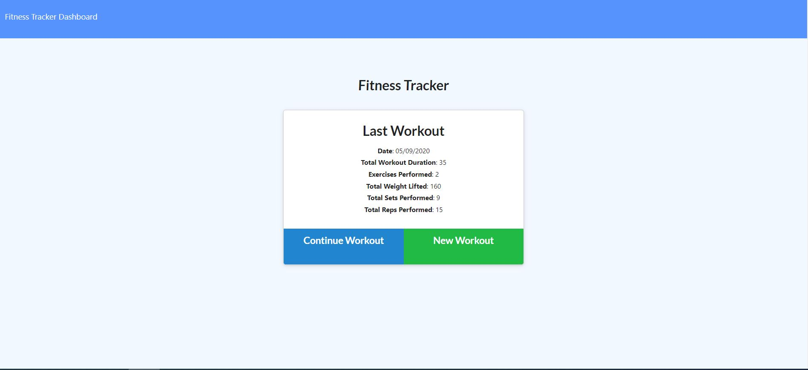

# Fitness Tracker

## Description
Fitness tracker is an app to create and track daily workouts. It is built primarily using node.js, mongoDB and express.
## Table of Contents
* [Installation](#installation)
* [Usage](#usage)
* [License](#license)
* [Contributing](#contributing)
* [Screenshot](#screenshot)
* [URL](#url)
* [Questions](#questions)
## Installation
Please download repository and run npm install and configure mongo database client in server.js and seed.js. It is currently hosted in heroku as well and URL is given in relevant section.
## Usage
User should be able to do following activities :
1. Add exercises to a previous workout plan.
2. Add new exercises to a new workout plan.
3. View last 30 days workouts stats in graphical view on workout dashboard page.
## Contributing
You are most welcome to contribute. There are following ways to contribute:
1. Please raise a pull request.
2. Please raise a new feature request.
3. Please raise a new issue.
All requests will be reviewed and processed accordingly.
## Screenshot

## URL
https://fitness-tracker-nm.herokuapp.com/
## License
This application is covered by [Unlicense](./LICENSE) license
## Questions
* Please raise a request at [github](https://github.com/nitinmuk)
* For any private question/enquiry, please reach out to my email: nitinmukes@gmail.com